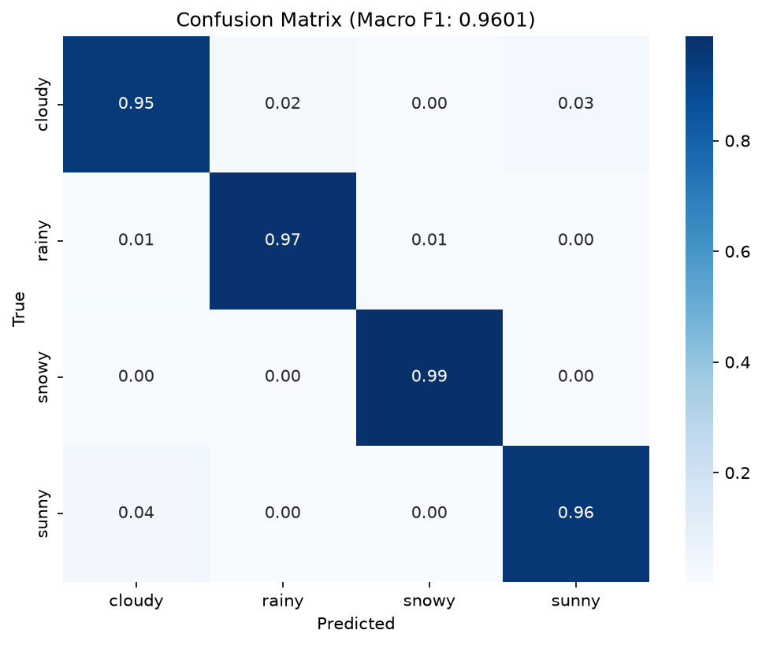

# Experiments Leaderboard — Weather Image Classification

> 更新日期：2026-06-20 | 排序：val_macro_f1 ↓

## 总排行榜

| # | Experiment | Model | Loss | Val F1 | rainy F1 | snowy F1 | cloudy F1 | sunny F1 | Best Epoch | CPU Time |
|---|-----------|-------|------|--------|----------|----------|-----------|----------|------------|----------|
| 1 | **exp_008** | ConvNeXt-Tiny | CE | **0.9071** 🥇 | 0.886 | 0.932 | 0.893 | 0.917 | 6 | 1.7 min |
| 2 | **exp_005** | EfficientNet-B1 | CE | **0.9014** 🥈 | 0.885 | 0.925 | 0.884 | 0.911 | 9 | 1.1 min |
| 3 | **exp_003** | ResNet-34 | CE | **0.9007** | 0.880 | — | — | — | 40 | 1.2 min |
| 4 | **exp_026** | ConvNeXt-Tiny | CE | **0.9000** ⚠️ | 0.869 | 0.925 | 0.888 | 0.918 | 8 | 384×384 bs=16 |
| 5 | **exp_020** | ResNet-18 | **LabelSmoothing** | **0.8968** | 0.863 | 0.922 | 0.887 | 0.915 | 23 | **CutMix α=1.0** |
| 6 | **exp_010** | ResNet-18 | **LabelSmoothing** | **0.8966** | 0.8649 | 0.9233 | 0.8872 | 0.9111 | 6 | 0.5 min |
| 7 | **exp_004** | EfficientNet-B0 | CE | **0.8963** | 0.865 | — | — | — | 8 | 0.8 min |
| 8 | **exp_009** | ResNet-50 | CE | **0.8916** | 0.855 | — | — | — | 5 | 1.7 min |
| 9 | **exp_019** | ResNet-18 | **LabelSmoothing** | **0.8912** | 0.858 | 0.909 | 0.885 | 0.912 | 23 | **MixUp α=0.2** |
| 10 | **exp_017** | ResNet-18 | **LabelSmoothing** | **0.8864** | 0.8484 | 0.9133 | 0.8771 | 0.9069 | 5 | Rotation 20° |
| 11 | **exp_011** | ResNet-18 | **FocalLoss** | **0.8847** | 0.8590 | 0.9076 | 0.8757 | 0.9051 | 15 | 0.5 min |
| 12 | **exp_018** | ResNet-18 | **LabelSmoothing** | **0.8841** | 0.8510 | 0.898 | 0.876 | 0.911 | 4 | RandAugment |
| 13 | **exp_013** | ResNet-18 | **Weighted CE** | **0.8841** | 0.8522 | 0.9154 | 0.8690 | 0.9006 | 13 | 0.5 min |
| 14 | **exp_012** | ResNet-18 | **Weighted CE** | **0.8791** | 0.8409 | 0.9059 | 0.8656 | 0.9058 | 6 | 0.5 min |
| 15 | **exp_001** | ResNet-18 | CE | **0.8708** | 0.8240 | 0.8927 | 0.8677 | 0.8990 | 5 | 0.5 min |
| 16 | **exp_002** | ResNet-18 | CE | **0.8618** | 0.8231 | 0.8769 | 0.8562 | 0.8909 | 7 | — |
| 17 | **exp_007** | MobileNetV3-Small | CE | **0.8173** ❌ | 0.752 | 0.787 | — | — | 1 | 0.3 min |

---

## 子榜 A — Backbone 筛选（CE loss, 224, 默认增强）

| # | Experiment | Model | Val F1 | rainy F1 | Params | Weight | CPU(3000) | Notes |
|---|-----------|-------|--------|----------|--------|--------|-----------|-------|
| 1 | exp_008 | ConvNeXt-Tiny | 0.9071 | 0.886 | 28.6M | 106 MB | 1.7 min | 过拟合严重，需提 dropout |
| 2 | exp_005 | EfficientNet-B1 | 0.9014 | 0.885 | 7.8M | 25 MB | 1.1 min | 性价比最优，batch=16 OOM 限制 |
| 3 | exp_003 | ResNet-34 | 0.9007 | 0.880 | 21.3M | 81 MB | 1.2 min | |
| 4 | exp_004 | EfficientNet-B0 | 0.8963 | 0.865 | 5.3M | 15 MB | 0.8 min | |
| 5 | exp_009 | ResNet-50 | 0.8916 | 0.855 | 25.6M | 90 MB | 1.7 min | |
| 6 | exp_001 | ResNet-18 | 0.8708 | 0.824 | 11.2M | 43 MB | 0.5 min | Baseline |
| 7 | exp_007 | MobileNetV3-Small | 0.8173 | 0.752 | 2.5M | 4 MB | 0.3 min | ❌ segfault 淘汰 |

## 子榜 B — Loss 对比（ResNet-18, 224, 默认增强）

| # | Experiment | Loss | Val F1 | rainy F1 | snowy F1 | cloudy F1 | sunny F1 | Δ vs CE | Best Epoch | Notes |
|---|-----------|------|--------|----------|----------|-----------|----------|---------|------------|-------|
| 1 | **exp_010** | **LabelSmoothing ε=0.1** | **0.8966** | 0.8649 | 0.9233 | 0.8872 | 0.9111 | **+2.6%** | 6 | ✅ Phase 1 最优，全类提升 |
| 2 | exp_011 | FocalLoss γ=2.0 | 0.8847 | 0.8590 | 0.9076 | 0.8757 | 0.9051 | +1.4% | 15 | rainy +3.5%，但曲线颠簸 |
| 3 | exp_013 | Weighted CE (balanced) | 0.8841 | 0.8522 | 0.9154 | 0.8690 | 0.9006 | +1.3% | 13 | 超 sqrt 但追不上 FocalLoss |
| 4 | exp_012 | Weighted CE (sqrt) | 0.8791 | 0.8409 | 0.9059 | 0.8656 | 0.9058 | +0.8% | 6 | 收益偏小，权重太保守 |
| — | exp_001 | CE baseline | 0.8708 | 0.8240 | 0.8927 | 0.8677 | 0.8990 | — | 5 | 对照 |

---

## 子榜 C — Size 对比（不同输入尺寸）

> 固定：CE loss + 默认增强 | 对照：exp_005 (B1-224) / exp_008 (CNX-224)

| # | Experiment | Backbone | Image Size | Val F1 | rainy F1 | CPU(3000) | Best Epoch | Notes |
|---|-----------|----------|------------|--------|----------|-----------|------------|-------|
| — | exp_021 | EfficientNet-B1 | 256 | — | — | — | — | 🔜 |
| — | exp_022 | EfficientNet-B1 | 320 | — | — | — | — | 🔜 |
| — | exp_023 | EfficientNet-B1 | 384 | — | — | — | — | 🔜 |
| — | exp_024 | ConvNeXt-Tiny | 256 | — | — | — | — | 🔜 |
| — | exp_025 | ConvNeXt-Tiny | 320 | — | — | — | — | 🔜 |
| — | exp_026 | ConvNeXt-Tiny | 384 | **0.9000** | 0.869 | — | 8 | ✅ bs=16, 不如 224 |

---

## 子榜 D — Augmentation 对比

> 固定：ResNet-18 + LabelSmoothing ε=0.1 | 对照：exp_010（默认增强）

| # | Experiment | Augmentation | Val F1 | rainy F1 | snowy F1 | cloudy F1 | sunny F1 | Δ vs exp_010 | Best Epoch | Notes |
|---|-----------|-------------|--------|----------|----------|-----------|----------|--------------|------------|-------|
| — | exp_014 | No Aug | 0.8948 | 0.8585 | 0.9227 | 0.8787 | 0.9081 | -0.2% | 14 | 增强边际小 |
| — | exp_015 | Light CJ | 0.8923 | 0.8628 | — | — | — | -0.4% | 6 | 太保守 |
| — | exp_016 | Medium CJ | 0.8890 | 0.8678 | — | — | — | -0.8% | 6 | rainy 新高但整体下降 |
| — | exp_017 | Rotation 20° | 0.8864 | 0.8484 | 0.9133 | 0.8771 | 0.9069 | -1.0% | 5 | 旋转过强损害性能 |
| — | exp_018 | RandAugment | 0.8841 | 0.8510 | 0.898 | 0.876 | 0.911 | -1.3% | 4 | 自动化增强不如手工 |
| — | exp_019 | MixUp α=0.2 | **0.8912** | 0.858 | 0.909 | 0.885 | 0.912 | -0.54% | 23 | ❌ 不如 CutMix |
| — | exp_020 | CutMix α=1.0 | **0.8968** | 0.863 | 0.922 | 0.887 | 0.915 | +0.02% | 23 | ✅ 追平 baseline |

---

## 子榜 E — Dropout 对比

> 固定：ConvNeXt-Tiny + best_size（待 A 组确定）+ CE | 对照：对应 size 的 d=0.3

| # | Experiment | Dropout | Val F1 | rainy F1 | train/val gap | Best Epoch | Notes |
|---|-----------|---------|--------|----------|---------------|------------|-------|
| — | exp_027 | 0.2 | — | — | — | — | 🔜 依赖 A 组 |
| — | exp_028 | 0.4 | — | — | — | — | 🔜 依赖 A 组 |
| — | exp_029 | 0.5 | — | — | — | — | 🔜 依赖 A 组 |

---

## exp_001: ResNet-18 + CE + 224 (Baseline)

### 训练配置

```yaml
experiment_id: exp_001
date: 2026-06-17
model: resnet18
config: configs/models/resnet18.yaml

# 训练参数
epochs: 5 (early stop at best)
batch_size: 64
learning_rate: 0.0001
optimizer: adamw
weight_decay: 0.0001
scheduler: cosine (warmup 3 epochs)
loss: cross_entropy
augmentation: default (ColorJitter 0.15, RandomResizedCrop, HFlip)
dropout: 0.3

# 数据
train_images: 13535
val_images: 3383
num_classes: 4 (cloudy, rainy, snowy, sunny)
seed: 42
```

### 训练曲线

| Epoch | Val F1 | Val Acc | Val Loss | Time | Best? |
|-------|--------|---------|----------|------|-------|
| 1 | 0.8442 | 0.8637 | 0.4676 | 360s | |
| 2 | 0.8245 | 0.8436 | 0.4758 | 359s | |
| 3 | 0.8624 | 0.8688 | 0.3854 | 358s | |
| 4 | 0.8726 | 0.8871 | 0.3496 | 351s | ⭐ (train) |
| **5** | **0.8735** | **0.8835** | **0.3507** | **348s** | **⭐ Best** |

### 验证集结果

```
Macro F1:  0.8708
Accuracy:  0.8784

Per-class:
  cloudy   Precision 0.8473  Recall 0.8892  F1 0.8677  (N=1660)
  rainy    Precision 0.9077  Recall 0.7544  F1 0.8240  (N=456)
  snowy    Precision 0.9118  Recall 0.8744  F1 0.8927  (N=390)
  sunny    Precision 0.8961  Recall 0.9019  F1 0.8990  (N=1722)

⚠ Weak classes: cloudy, rainy
```

### 混淆矩阵



### CPU 性能

| Batch Size | Per-Image (ms) | Throughput (imgs/s) |
|------------|---------------|---------------------|
| 1 | 8.91 | 112.2 |
| 4 | 6.38 | 156.8 |
| **8** | **5.38** | **185.7** ⭐ |
| 16 | 5.87 | 170.4 |
| 32 | 6.98 | 143.3 |
| 64 | 7.45 | 134.1 |

```
Model: resnet18 (11.18M params, 42.6 MB)
Optimal batch: 8
3000 images: 0.5 min ✅ (70 min limit)
```

### 关键发现

1. **rainy 是瓶颈**：F1 仅 0.82，召回率 0.75——最容易误分为 cloudy
2. **类别不平衡显著**：rainy (1828) / snowy (1562) vs cloudy (6640) / sunny (6888)
3. **5 个 epoch 即接近收敛**：F1 从 epoch 1→4 提升 0.03，之后趋于平稳
4. **CPU 推理无压力**：0.5 min / 3000 张，远超 70min 限制
5. **WSL2 训练不稳定**：num_workers=0 + OMP_NUM_THREADS 控制线程数是稳定训练的关键

---

## exp_002: ResNet-18 + CE + 224 (No Augmentation)

### 训练配置

```yaml
experiment_id: exp_002
date: 2026-06-17
model: resnet18
augmentation: none (scale=1.0, no flip, no rotation, no color jitter)
其余配置同 exp_001
```

### 训练曲线

| Epoch | Val F1 | Acc | Loss | Time | Best? |
|-------|--------|-----|------|------|-------|
| 1 | 0.8637 | 0.8767 | 0.3603 | 496s | |
| 2 | 0.8537 | 0.8682 | 0.4093 | 493s | |
| 3 | 0.8570 | 0.8696 | 0.5091 | 592s | |
| 4 | 0.8588 | 0.8682 | 0.5688 | 586s | |
| 5 | 0.8598 | 0.8699 | 0.6004 | 493s | |
| 6 | 0.8593 | 0.8714 | 0.6383 | 480s | |
| **7** | **0.8769** | **0.8850** | **0.6867** | **487s** | **⭐ Best** |
| 8 | 0.8637 | 0.8753 | 0.7303 | 482s | |
| 14 | 0.8726 | 0.8815 | 0.7953 | — | |
| 17 | 0.8689 | 0.8782 | 0.8736 | — | Early Stop |

### 验证集结果（evaluate.py, data/val）

```
Macro F1:  0.8618
Accuracy:  0.8690

Per-class:
  cloudy   Precision 0.8516  Recall 0.8608  F1 0.8562
  rainy    Precision 0.8704  Recall 0.7807  F1 0.8231
  snowy    Precision 0.8769  Recall 0.8769  F1 0.8769
  sunny    Precision 0.8835  Recall 0.8984  F1 0.8909
```

### 对比总结

| 指标 | Augmented (exp_001) | No-Aug (exp_002) | Δ |
|------|:---:|:---:|:---:|
| Val F1 | 0.8708 | 0.8618 | **+0.9%** |
| rainy F1 | 0.8240 | 0.8231 | +0.1% |
| Loss 轨迹 | 稳定 (0.35~0.47) | 持续攀升 (0.36→0.87) | 过拟合 |
| 收敛速度 | epoch 5 | epoch 7 | 慢 2 epoch |

### 结论

增强贡献约 **+0.9% F1**，不算大但显著。主要价值是**抑制过拟合**（loss 稳定 vs 持续攀升）和**加速收敛**（快 2 epoch）。rainy 的瓶颈不是增强能解决的——两个实验 rainy F1 几乎一样，必须靠 FocalLoss 或类别权重。

---
## Backbone 筛选总结 (2026-06-19)

**Top 2 进入 Phase 2：ConvNeXt-Tiny + EfficientNet-B1**

| Exp | Model | Val F1 | rainy | snowy | cloudy | sunny | CPU(3000) | Weight | Batch | Epoch | Notes |
|-----|-------|--------|-------|-------|--------|-------|-----------|--------|-------|-------|-------|
| 008 | ConvNeXt-Tiny | 0.9071 | 0.886 | 0.932 | 0.893 | 0.917 | 1.7 min | 106 MB | 32 | 6 | 严重过拟合,需提 dropout |
| 005 | EfficientNet-B1 | 0.9014 | 0.885 | 0.925 | 0.884 | 0.911 | 1.1 min | 25 MB | 16 | 9 | 64/32 均 OOM |
| 003 | ResNet-34 | 0.9007 | 0.880 | — | — | — | 1.2 min | 81 MB | 64 | 40 | |
| 004 | EfficientNet-B0 | 0.8963 | 0.865 | — | — | — | 0.8 min | 15 MB | 64 | 8 | |
| 001 | ResNet-18 | 0.8708 | 0.824 | 0.893 | 0.868 | 0.899 | 0.5 min | 43 MB | 64 | 5 | Baseline |
| 007 | MobileNetV3-Small | 0.8173 | 0.752 | 0.787 | — | — | 0.3 min | 4 MB | 64 | 1 | ❌ 淘汰; segfault |
| — | EfficientNet-B2 | — | — | — | — | — | — | — | — | — | ⏭️ 跳过 |

### 关键发现

1. **ConvNeXt-Tiny 最强但过拟合严重** — loss 0.38→0.78，需提 dropout
2. **EfficientNet-B1 性价比最优** — F1 差 0.006，权重小 4×，CPU 快 35%
3. **B0→B1 提升显著** — +0.005 F1, rainy +0.02
4. **MobileNetV3 不可用** — F1<0.83 + segfault 崩溃

---

## Loss 对比总结 (Phase 1, 2026-06-19)

**LabelSmoothing ε=0.1 胜出，进入 Phase 2**

| 结论 | 详情 |
|------|------|
| 最优 Loss | LabelSmoothing ε=0.1，F1 0.8966 (+2.6% vs CE) |
| 收敛特性 | 极快（epoch 2 超 baseline）、平滑、无 FocalLoss 式震荡 |
| rainy 提升 | 0.8240 → 0.8649 (+4.1%)，超过 FocalLoss 的 0.8590 |
| 大类影响 | cloudy/sunny 同步提升，无 tradeoff |
| 失败策略 | Weighted CE 收益仅 +0.8%，sqrt 权重过于保守；balanced 权重可能泛化差 |
| 下一步 | Phase 2: 固定 LabelSmoothing，对比 augmentation 策略 |

---

## exp_010: ResNet-18 + LabelSmoothing ε=0.1 + 默认增强

### 训练配置

```yaml
experiment_id: exp_010
date: 2026-06-19
model: resnet18
loss: label_smoothing (ε=0.1)
augmentation: default (ColorJitter 0.15, RRC, HFlip, Rotation 10)
其余同 baseline
```

### 训练曲线

| Epoch | Val F1 | rainy F1 | Val Loss | Best? |
|-------|--------|----------|----------|-------|
| 1 | 0.8538 | 0.8117 | 0.9628 | |
| 2 | 0.8736 | 0.8384 | 0.6808 | |
| 3 | 0.8760 | 0.8434 | 0.6809 | |
| 4 | 0.8816 | 0.8510 | 0.6882 | |
| 5 | 0.8771 | 0.8354 | 0.7100 | |
| **6** | **0.8966** | **0.8649** | **0.6343** | **⭐ Best** |
| 7 | 0.8882 | 0.8613 | 0.6440 | |
| 15 | 0.8906 | 0.8591 | 0.6494 | 次优 |
| 16 | 0.8829 | 0.8406 | 0.6565 | Early Stop |

### 关键发现

1. epoch 2 即超 baseline (0.8708)，收敛极快
2. epoch 6 尖峰 0.8966，后续稳定在 0.882-0.891
3. rainy F1 0.8649 超 FocalLoss 的 0.8590——LabelSmoothing 通过释放 cloudy/sunny 过拟合间接帮了 rainy
4. 全类同步提升，无 tradeoff

---

## exp_011: ResNet-18 + FocalLoss γ=2.0 + 默认增强

### 训练配置

```yaml
experiment_id: exp_011
date: 2026-06-19
model: resnet18
loss: focal (γ=2.0, 无类权重)
augmentation: default
其余同 baseline
```

### 训练曲线

| Epoch | Val F1 | rainy F1 | Val Loss | Best? |
|-------|--------|----------|----------|-------|
| 1 | 0.8276 | 0.7570 | 0.2998 | |
| 5 | 0.8819 | 0.8393 | 0.1630 | |
| 8 | 0.8825 | 0.8426 | 0.1490 | |
| 13 | 0.8741 | 0.8435 | 0.1988 | |
| **15** | **0.8847** | **0.8590** | **0.1778** | **⭐ Best** |
| 17 | 0.8738 | 0.8363 | 0.2233 | Killed |

### 关键发现

1. epoch 1 rainy recall 飙升 (+11%) 但 precision 暴跌——FocalLoss 初期过度关注 hard sample
2. epoch 2-3 自动修正了 precision-recall 平衡
3. rainy F1 最高 0.8590，连续 6+ epoch 全部高于 baseline
4. 曲线颠簸（epoch 间差 0.015），不如 LabelSmoothing 稳定
5. ValLoss 后期攀升 (0.178→0.223)，有过拟合趋势

---

## exp_012: ResNet-18 + Weighted CE (sqrt) + 默认增强

### 训练配置

```yaml
experiment_id: exp_012
date: 2026-06-19
model: resnet18
loss: cross_entropy + class_weights=[0.80,1.52,1.65,0.78] (sqrt)
augmentation: default
其余同 baseline
```

### 训练曲线

| Epoch | Val F1 | rainy F1 | Val Loss | Best? |
|-------|--------|----------|----------|-------|
| 1 | 0.8092 | 0.7224 | 0.6965 | |
| 2 | 0.8557 | 0.8180 | 0.3632 | |
| 3 | 0.8725 | 0.8339 | 0.3568 | |
| 4 | 0.8674 | 0.8276 | 0.3811 | |
| 5 | 0.8728 | 0.8335 | 0.3804 | |
| **6** | **0.8791** | **0.8392** | **0.3500** | **⭐ Best** |
| 7 | 0.8776 | 0.8409 | 0.3886 | Killed |

### 关键发现

1. 起步最慢（epoch 1 仅 0.8092），sqrt 权重极差 2.1× 过于保守
2. 最终仅 +0.8% vs CE baseline，远低于 LabelSmoothing +2.6%
3. rainy 提升有限 (+1.7%)，主要的类不平衡问题已被 LabelSmoothing 更好地解决
4. 不推荐继续，且 balanced 权重泛化风险高

---

## 实验模板 (Ctrl+C 复制)

```markdown
## exp_XXX: Model + Loss + ImageSize

### 训练配置
- date: YYYY-MM-DD
- model: xxx
- epochs: N
- batch_size: N
- lr: 0.xxxx
- loss: xxx
- augmentation: xxx

### 结果
- Val F1: 0.xxxx
- Per-class: cloudy x.xxx / rainy x.xxx / snowy x.xxx / sunny x.xxx
- CPU time (3000): x.x min

### 备注
- xxx
```

